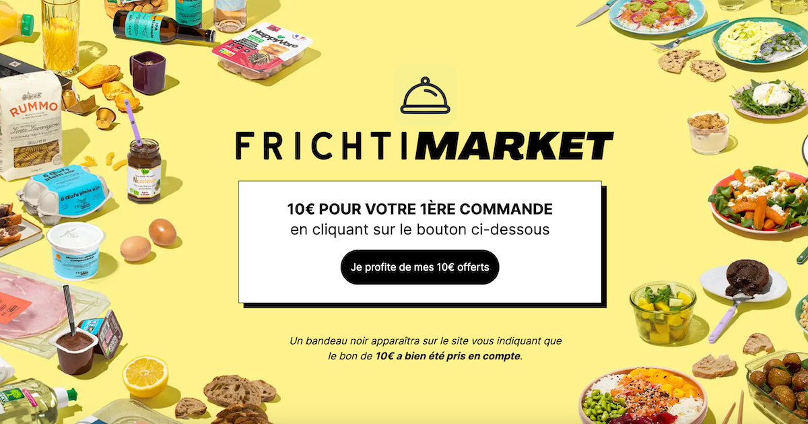
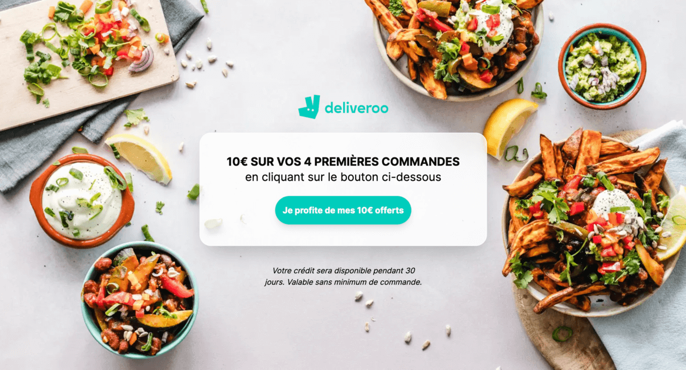

# Sponsor Me

Sponsor Me is a repository that includes several Next.js applications to provide my sponsorship link of some websites (`deliveroo`, `frichti-market`, ...). The folder `apps` contains applications deployed on Vercel.

## Created with Sponsor Me

<table>
<tr>
<td align="center">

<p><a href="https://www.frichti-market-code-promo.fr">frichti-market-code-promo.fr</a></p>
</td>
<td align="center">

<p><a href="https://www.deliveroo-promo-code.com">deliveroo-promo-code.com</a></p>
</td>
<td align="center">
<em>View <a href="#websites-list">More created websites</a> !</em>
</td>
</tr>
</table>

## Get started by creating a new website

This package uses [turbo](https://turbo.build/) and [pnpm](https://pnpm.io/fr).

If you already have Node.JS installed, type:

```console
pnpm run create-sponsor
```

A prompt will ask you a name for the product (e.g: Uber Eats)

Then run

```console
pnpm i && pnpm run dev
```

All websites use a different port so no worries about conflicts.

Now, you have to update the `metas.tsx` file, the `public` folder, and some meta icons files **at the root of your website application project**.

## Websites list

* https://www.frichti-market-code-promo.fr ➡️ for [Frichti Market 🇫🇷](https://www.frichtimarket.com) ;
* https://www.labellevie-code-promo.fr ➡️ for [La Belle Vie 🇫🇷](https://www.labellevie.com) ;
* https://www.deliveroo-promo-code.com ➡️ for [Deliveroo](https://deliveroo.com) ;

### What I use to develop a website 🚀

- [Next](https://github.com/facebook/react) - Framework JS.
- [Tailwind](https://tailwind.com) - CSS utilities.
- [TypeScript](https://www.typescriptlang.org/) - Language.

## Releases

[Vercel](https://vercel.com) is connected tp this repository, so all you have to do is to push to the `main` branch and all deployments will be carried out.

